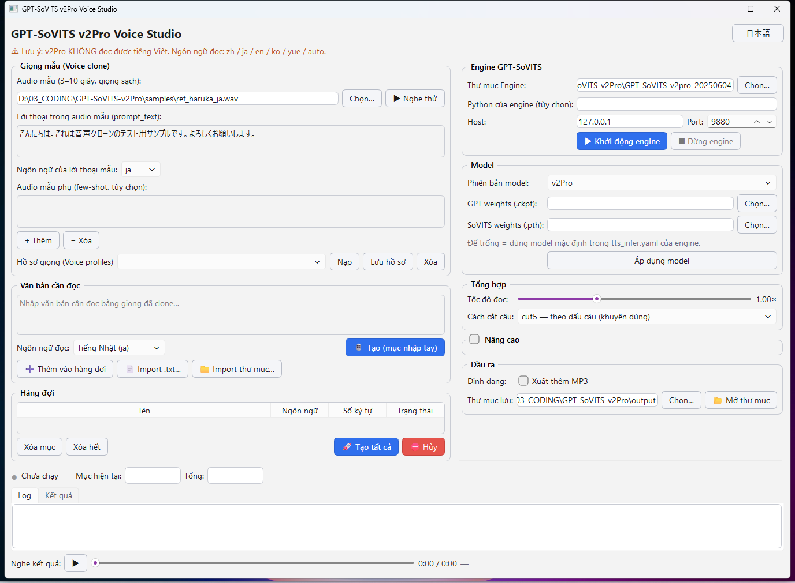

# GPT-SoVITS v2Pro Voice Studio

**VI:** Ứng dụng desktop Windows để **nhân bản giọng nói (voice clone)** và **tổng hợp giọng đa ngôn ngữ** bằng GPT-SoVITS **v2Pro** — chỉ cần 1 đoạn audio mẫu 3–10 giây, không cần huấn luyện.

**JA:** GPT-SoVITS **v2Pro** による**ボイスクローン**・**多言語音声合成**の Windows デスクトップアプリ。3～10秒の参照音声だけでクローン可能、学習不要。

> 📖 **Hướng dẫn sử dụng chi tiết (tiếng Việt):** [docs/HUONG_DAN_SU_DUNG.md](docs/HUONG_DAN_SU_DUNG.md)



**Tính năng chính / 主な機能:** voice clone 3–10s (zero/few-shot) · đọc 5 ngôn ngữ + cross-language · batch từ `.txt` · **cắt audio mẫu trên waveform** · **xuất phụ đề `.srt` khớp từng câu** · **chuẩn hóa loudness −14 LUFS (YouTube)** · **ghép batch thành audiobook** (`merged.wav` + `merged.srt`) · WAV/MP3 · voice profiles · UI song ngữ VI/JA

---

## Kiến trúc / アーキテクチャ

```
GUI (PySide6, env nhẹ)  ── HTTP localhost:9880 ──▶  Engine: api_v2.py chính thức của GPT-SoVITS
        │                                            (env riêng: Python nhúng + PyTorch + model v2Pro)
        └── tự khởi động engine như subprocess, chờ sẵn sàng, gọi POST /tts
```

- GUI và engine chạy **2 môi trường Python tách biệt** — không xung đột thư viện.
- GUI **không viết lại** pipeline inference; chỉ gọi API chính thức.

> ⚠️ **v2Pro KHÔNG hỗ trợ đọc tiếng Việt.** Ngôn ngữ đọc: `zh` (Trung), `ja` (Nhật), `en` (Anh), `ko` (Hàn), `yue` (Quảng Đông) và `auto`.
> ⚠️ **v2Pro はベトナム語読み上げ非対応。** 対応言語: zh / ja / en / ko / yue / auto。

---

## 1. Cài đặt Engine / エンジンの準備

### Cách 1 — Gói tích hợp Windows (khuyên dùng / 推奨)

1. Tải gói `GPT-SoVITS-v2pro-*.7z` (ví dụ `GPT-SoVITS-v2pro-20250604.7z`) từ trang phát hành chính thức của RVC-Boss/GPT-SoVITS (GitHub Releases / HuggingFace).
2. Giải nén ra một thư mục, ví dụ `D:\GPT-SoVITS-v2pro-20250604\`.
   Gói này đã kèm sẵn: Python nhúng (`runtime\python.exe`), PyTorch, model **v2Pro/v2ProPlus**, BERT, cnhubert, SV embedding.
3. Không cần cài gì thêm.

### Cách 2 — Từ source / ソースから

1. Clone `https://github.com/RVC-Boss/GPT-SoVITS`, tạo env riêng theo hướng dẫn repo (Python 3.9/3.10 + PyTorch CUDA).
2. Tải `GPT_SoVITS/pretrained_models` gồm model v2Pro (GPT `.ckpt` + SoVITS `s2Gv2Pro.pth` / `s2Gv2ProPlus.pth`, BERT, cnhubert, **sv** embedding).
3. Trong app, điền "Python của engine" trỏ tới python.exe của env đó (nếu không có `runtime\python.exe`).

> 💻 GPU NVIDIA khuyến nghị mạnh. Không có GPU vẫn chạy được bằng CPU nhưng **rất chậm** — app sẽ cảnh báo.

---

## 2. Chạy app / アプリの起動

### Chạy nhanh từ source (không cần build)

```bat
run.bat
```

(tự tạo venv GUI + cài `requirements.txt` + mở app — cần Python 3.10–3.12 trên máy)

### Các bước sử dụng / 使い方

1. **Settings → Engine folder:** trỏ tới thư mục đã giải nén (chứa `api_v2.py`).
2. Bấm **▶ Khởi động engine / エンジン起動** → chờ đèn chuyển **xanh "Sẵn sàng / 準備完了"** (lần đầu có thể lâu do nạp model).
3. **Giọng mẫu:** chọn file audio ~3–10s (giọng sạch, ít tạp âm) + gõ **đúng lời thoại** trong audio đó (prompt_text) + chọn ngôn ngữ của lời thoại.
4. Gõ văn bản cần đọc, chọn **ngôn ngữ đọc** (ja/en/zh/ko/yue/auto) → bấm **🎙 Tạo**.
5. Hoặc **Import .txt / thư mục** → hàng đợi → **🚀 Tạo tất cả** (batch).
6. Kết quả: mỗi đầu vào một thư mục `{YYYYMMDD_HHMMSS}_{tên}` trong Output base, gồm `output.wav` (+`output.mp3` nếu bật), `input.txt`, `ref_used.*`, `meta.json`.

Mẹo / ヒント:
- **Voice profile:** lưu bộ (ref audio + prompt) để tái dùng nhanh.
- **Aux refs (few-shot):** thêm vài audio phụ cùng người nói để tăng độ giống.
- **Cross-language:** cùng một giọng mẫu tiếng Nhật vẫn đọc được tiếng Anh/Trung/Hàn.
- **Seed cố định** trong "Nâng cao" để tái lập kết quả; seed thực tế luôn ghi trong `meta.json`.

---

## 3. Build `.exe`

```bat
build_exe.bat
```

→ `dist\VoiceStudio\VoiceStudio.exe` (PyInstaller `--onedir`, chỉ chứa GUI).

**Lưu ý:** exe KHÔNG chứa GPT-SoVITS/PyTorch/model (nhiều GB). App là frontend/launcher — máy đích vẫn cần gói engine v2Pro giải nén sẵn và trỏ Engine folder trong Settings.

---

## 4. Cấu trúc / 構成

```
app/
├─ main.py            # điểm vào QApplication
├─ ui_main.py         # cửa sổ chính, bố cục, i18n áp dụng
├─ engine_manager.py  # start/stop api_v2.py (subprocess), dò python/weights
├─ engine_client.py   # HTTP /tts, /set_*_weights, /control
├─ worker.py          # QThread batch + signals (UI không đơ)
├─ output_writer.py   # thư mục timestamp+tên, wav/mp3/meta.json
├─ profiles.py        # voice profiles → profiles.json
├─ i18n.py            # chuỗi song ngữ VI/JA
└─ settings.py        # settings.json
```

Cấu hình người dùng lưu tại `%APPDATA%\GPT-SoVITS-VoiceStudio\` (`settings.json`, `profiles.json`).

---

## 5. Xử lý sự cố / トラブルシューティング

| Vấn đề | Cách xử lý |
|---|---|
| Đèn engine báo Lỗi | Kiểm tra Engine folder có `api_v2.py`; xem tab Log; thử port khác nếu 9880 bận |
| Không tìm thấy Python engine | Gói tích hợp phải có `runtime\python.exe`; bản source thì điền "Python của engine" thủ công |
| CUDA out of memory | Giảm `batch_size` (Nâng cao), đóng app khác, dùng văn bản ngắn hơn |
| Chạy CPU quá chậm | Bình thường — v2Pro cần GPU NVIDIA để nhanh |
| Giọng chưa giống | Dùng audio mẫu sạch 3–10s, điền đúng prompt_text, thêm aux refs |
| Không xuất được MP3 | Cần `pydub` + `imageio-ffmpeg` (có sẵn trong requirements.txt) |

