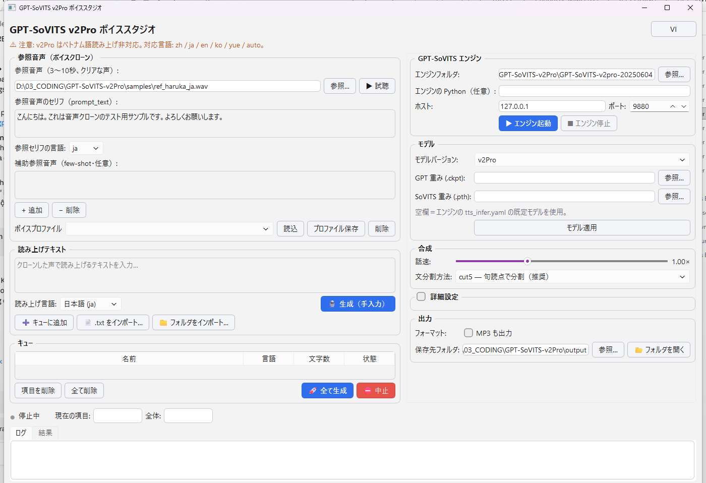
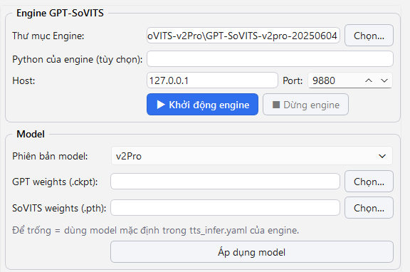
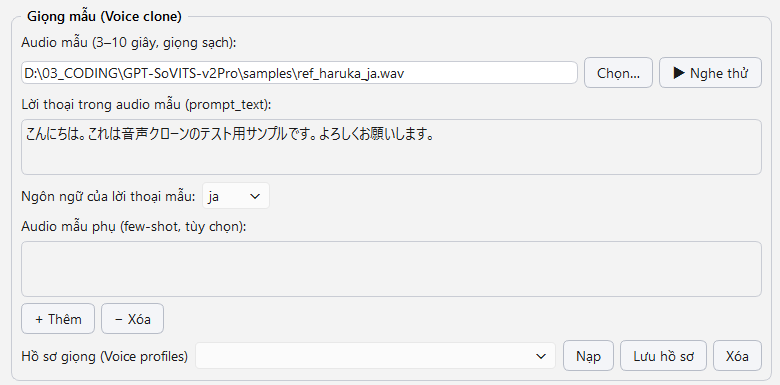
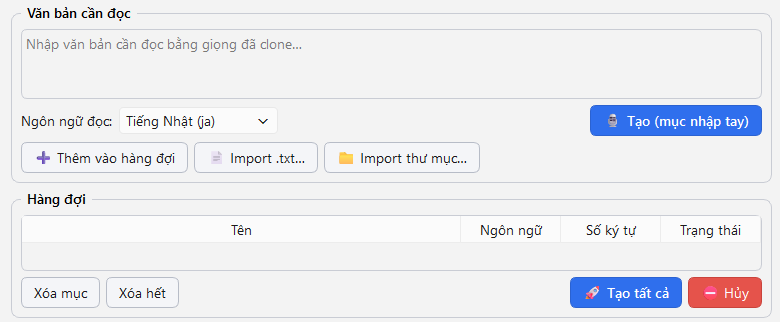
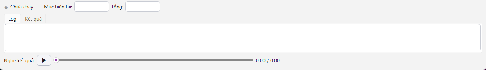
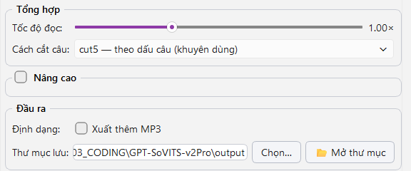

# HƯỚNG DẪN SỬ DỤNG CHI TIẾT — GPT-SoVITS v2Pro Voice Studio

> Phiên bản tài liệu: 1.0 (2026-07-04) · Áp dụng cho app v1.0.0
> Giao diện app song ngữ Việt–Nhật; tài liệu này viết bằng tiếng Việt, tên nút ghi kèm theo giao diện tiếng Việt.

---

## Mục lục

1. [Ứng dụng làm gì?](#1-ứng-dụng-làm-gì)
2. [Khái niệm cần hiểu trước khi dùng](#2-khái-niệm-cần-hiểu-trước-khi-dùng)
3. [Yêu cầu hệ thống & cài đặt](#3-yêu-cầu-hệ-thống--cài-đặt)
4. [Tổng quan giao diện](#4-tổng-quan-giao-diện)
5. [Bước 1 — Khởi động Engine](#5-bước-1--khởi-động-engine)
6. [Bước 2 — Chuẩn bị giọng mẫu (quan trọng nhất)](#6-bước-2--chuẩn-bị-giọng-mẫu-quan-trọng-nhất)
7. [Bước 3 — Tạo giọng nói](#7-bước-3--tạo-giọng-nói)
8. [Xử lý hàng loạt (Batch)](#8-xử-lý-hàng-loạt-batch)
9. [Hồ sơ giọng (Voice profiles)](#9-hồ-sơ-giọng-voice-profiles)
10. [Giải thích toàn bộ Settings](#10-giải-thích-toàn-bộ-settings)
11. [Kết quả đầu ra](#11-kết-quả-đầu-ra)
12. [Mẹo nâng cao chất lượng giọng](#12-mẹo-nâng-cao-chất-lượng-giọng)
13. [Xử lý sự cố](#13-xử-lý-sự-cố)
14. [Câu hỏi thường gặp (FAQ)](#14-câu-hỏi-thường-gặp-faq)
15. [Hội thoại đa giọng](#15-hội-thoại-đa-giọng)
16. [CLI mode (chạy không cần GUI)](#16-cli-mode-chạy-không-cần-gui)

---

## 1. Ứng dụng làm gì?

**Voice Studio** nhân bản (clone) một giọng nói bất kỳ từ **một đoạn thu âm 3–10 giây**, rồi dùng giọng đó để **đọc văn bản bất kỳ** bằng 5 ngôn ngữ:

| Mã | Ngôn ngữ |
|----|----------|
| `ja` | Tiếng Nhật |
| `en` | Tiếng Anh |
| `zh` | Tiếng Trung (Quan thoại) |
| `ko` | Tiếng Hàn |
| `yue` | Tiếng Quảng Đông |
| `auto` | Tự nhận diện / văn bản trộn nhiều ngôn ngữ |

> ⚠️ **v2Pro KHÔNG đọc được tiếng Việt.** Giao diện app có tiếng Việt, nhưng ngôn ngữ *đọc* chỉ gồm 5 ngôn ngữ trên. Đây là giới hạn của model GPT-SoVITS v2Pro, không phải của app.

**Không cần huấn luyện (training).** Đây là zero-shot voice clone: đưa audio mẫu vào là dùng được ngay. Muốn giống hơn nữa có thể thêm vài audio phụ (few-shot) — vẫn không cần train.

**Cross-language:** giọng mẫu tiếng Nhật vẫn đọc được tiếng Anh/Trung/Hàn — chất giọng giữ nguyên, ngôn ngữ thay đổi.

---

## 2. Khái niệm cần hiểu trước khi dùng

| Thuật ngữ | Nghĩa |
|---|---|
| **Engine** | Server GPT-SoVITS (`api_v2.py`) chạy ngầm, làm toàn bộ việc AI. App tự bật/tắt nó. |
| **Audio mẫu (ref audio)** | Đoạn thu âm 3–10 giây của giọng cần clone. Chất lượng đoạn này quyết định 80% kết quả. |
| **prompt_text** | Lời thoại *chính xác từng chữ* được nói trong audio mẫu. Giúp model "hiểu" audio mẫu tốt hơn nhiều. |
| **Ngôn ngữ prompt** | Ngôn ngữ của lời thoại trong audio mẫu (khác với ngôn ngữ đọc). |
| **Ngôn ngữ đọc (text_lang)** | Ngôn ngữ của văn bản muốn tạo giọng. |
| **Audio mẫu phụ (aux refs)** | Các đoạn thu âm thêm của *cùng người nói* để hòa trộn chất giọng (few-shot). |
| **Voice profile** | Bộ lưu sẵn (audio mẫu + prompt_text + ngôn ngữ) để tái dùng 1 cú click. |
| **Seed** | Số điều khiển tính ngẫu nhiên. Cùng seed + cùng tham số = kết quả giống nhau (tái lập được). |

---

## 3. Yêu cầu hệ thống & cài đặt

### Yêu cầu

- **Windows 10/11 64-bit**
- **GPU NVIDIA** từ 6GB VRAM (khuyến nghị mạnh — RTX 4060 8GB của máy này chạy ~5 giây/câu). Không có GPU vẫn chạy được bằng CPU nhưng **chậm hơn 20–50 lần**.
- ~15 GB trống (gói engine 7.6 GB nén / ~11 GB giải nén).
- Python 3.10–3.12 (chỉ cần nếu chạy từ source bằng `run.bat`).

### Trạng thái máy này (đã cài sẵn)

| Thành phần | Vị trí |
|---|---|
| App (source + venv) | `D:\03_CODING\GPT-SoVITS-v2Pro\` |
| Engine v2Pro | `D:\03_CODING\GPT-SoVITS-v2Pro\GPT-SoVITS-v2pro-20250604\` |
| Giọng mẫu test | `samples\ref_haruka_ja.wav` (+ lời thoại trong `.txt` cùng tên) |
| Cấu hình người dùng | `%APPDATA%\GPT-SoVITS-VoiceStudio\` (`settings.json`, `profiles.json`) |
| Kết quả mặc định | `D:\03_CODING\GPT-SoVITS-v2Pro\output\` |

### Cách mở app

- **Cách 1 (khuyên dùng):** nháy đúp `run.bat` — tự kiểm tra venv rồi mở app.
- **Cách 2:** nếu đã build exe: `dist\VoiceStudio\VoiceStudio.exe`.

### Cài trên máy khác

1. Copy thư mục app (hoặc bản exe đã build bằng `build_exe.bat`).
2. Tải gói engine `GPT-SoVITS-v2pro-*.7z` từ GitHub Releases của RVC-Boss/GPT-SoVITS (link tải nằm trong release tag `20250606v2pro`, file thực tế trên HuggingFace). Máy dùng GPU RTX 50xx thì tải bản "for 50x0 Nvidia GPU".
3. Giải nén bằng 7-Zip vào đường dẫn **không dấu, không khoảng trắng**.
4. Mở app → Settings → trỏ *Thư mục Engine* → Khởi động engine.

---

## 4. Tổng quan giao diện

Giao diện tiếng Việt (mặc định):


Bấm nút **[日本語]** góc trên phải để chuyển toàn bộ giao diện sang tiếng Nhật (bấm **[VI]** để quay lại):



Sơ đồ bố cục:

```
┌────────────────────────────────────────────────────────────────────┐
│  GPT-SoVITS v2Pro Voice Studio                        [ 日本語 ]   │  ← nút đổi ngôn ngữ UI
│  ⚠ Lưu ý: v2Pro không đọc được tiếng Việt…                        │
├──────────────────────────────┬─────────────────────────────────────┤
│ TRÁI                         │ PHẢI — Cài đặt                      │
│ ┌─ Giọng mẫu (Voice clone) ─┐│ ┌─ Engine GPT-SoVITS ─┐            │
│ │ audio mẫu + nghe thử      ││ │ thư mục, host/port,  │            │
│ │ prompt_text + ngôn ngữ    ││ │ Start/Stop           │            │
│ │ audio phụ (few-shot)      ││ ├─ Model ─┐                        │
│ │ hồ sơ giọng               ││ │ v2Pro / v2ProPlus    │            │
│ ├─ Văn bản cần đọc ─────────┤│ ├─ Tổng hợp ─┐                     │
│ │ ô nhập + ngôn ngữ đọc     ││ │ tốc độ, cách cắt câu │            │
│ │ [Tạo] [Thêm vào hàng đợi] ││ ├─ Nâng cao (gập) ─┐               │
│ │ [Import .txt] [Import 📁] ││ │ top_k…seed           │            │
│ ├─ Hàng đợi ────────────────┤│ ├─ Đầu ra ─┐                       │
│ │ bảng: tên/ngôn ngữ/ký tự/ ││ │ MP3, thư mục lưu     │            │
│ │ trạng thái                ││ └──────────────────────┘            │
│ │ [Tạo tất cả] [Hủy]        ││                                     │
├──┴───────────────────────────┴─────────────────────────────────────┤
│ ● Sẵn sàng   Mục hiện tại: ▓▓▓░░  Tổng: 2/5                       │  ← đèn engine + tiến độ
│ [ Log | Kết quả ]                                                  │  ← 2 tab
│ ▶ ────────●──── 0:03/0:06  output.wav                              │  ← trình nghe thử
└────────────────────────────────────────────────────────────────────┘
```

**Nút chuyển ngôn ngữ** góc trên phải: xoay vòng **Tiếng Việt → 日本語 → English** — đổi toàn bộ nhãn giao diện ngay lập tức (nhãn trên nút là ngôn ngữ *sẽ chuyển sang*).

**Đèn trạng thái engine** (góc dưới trái):

| Màu | Trạng thái | Ý nghĩa |
|---|---|---|
| ⚪ Xám | Chưa chạy | Engine chưa bật — bấm "Khởi động engine" |
| 🟡 Vàng | Đang khởi động | Đang nạp model (~10 giây; lần đầu có thể vài phút) |
| 🟢 Xanh | Sẵn sàng | Có thể tạo giọng |
| 🔴 Đỏ | Lỗi | Xem tab Log để biết nguyên nhân |

---

## 5. Bước 1 — Khởi động Engine



1. Mở app. Ô **Thư mục Engine** (panel phải) phải trỏ tới thư mục chứa `api_v2.py`
   (máy này đã điền sẵn: `D:\03_CODING\GPT-SoVITS-v2Pro\GPT-SoVITS-v2pro-20250604`).
2. Bấm **▶ Khởi động engine**.
3. Đèn chuyển 🟡 → theo dõi tab **Log**: sẽ thấy `TTS Config`, `device: cuda`, `version: v2Pro`, các dòng `Loading ... weights`.
4. Khi thấy `Engine sẵn sàng.` và đèn 🟢 → xong.

Ghi chú:
- Engine chiếm ~2–4 GB VRAM khi chạy. Bấm **■ Dừng engine** khi không dùng để giải phóng.
- Nếu máy không có GPU NVIDIA, app ghi cảnh báo vào Log và engine chạy CPU (rất chậm nhưng vẫn ra kết quả).
- Đóng app sẽ tự dừng engine — không để tiến trình mồ côi.
- Host/port mặc định `127.0.0.1:9880`. Chỉ đổi port khi bị trùng với phần mềm khác (đổi xong bấm Khởi động lại engine).
- Tick **"Tự khởi động engine khi mở app"** để lần sau mở app là engine tự chạy — khỏi bấm nút và chờ.

---

## 6. Bước 2 — Chuẩn bị giọng mẫu (quan trọng nhất)



Chất lượng audio mẫu quyết định phần lớn độ giống. Chuẩn bị như sau:

### Yêu cầu bắt buộc

- **Độ dài 3–10 giây.** Ngoài khoảng này engine từ chối (báo lỗi 400). Lý tưởng: 5–8 giây.
- Định dạng wav/mp3/flac/ogg/m4a đều được.

### Yêu cầu chất lượng (quyết định độ giống)

- **Một người nói duy nhất**, không nhạc nền, không tiếng ồn, không echo.
- Nói **liền mạch tự nhiên**, âm lượng đều, không quá nhỏ/không vỡ tiếng.
- Câu nói có ngữ điệu bình thường (không hét, không thì thầm) — trừ khi bạn *muốn* clone đúng kiểu cảm xúc đó: model bắt chước cả ngữ điệu của mẫu.

### Thao tác trong app

1. **Kéo-thả** file vào ô audio mẫu (hoặc bấm *Chọn…*).
2. Bấm **▶ Nghe thử** để kiểm tra đúng file, đủ rõ.
   - File dài quá 10 giây? Bấm **✂ Cắt 3–10s…**: hộp thoại hiện **waveform**, kéo 2 mốc xanh/đỏ (hoặc nhập số giây) để chọn đoạn, bấm *▶ Nghe đoạn chọn* kiểm tra, rồi *💾 Lưu bản cắt & dùng* — app tự tạo file `_cut.wav` cạnh file gốc và dùng ngay. Nút Lưu chỉ mở khi đoạn chọn nằm trong 3–10 giây.
3. Gõ **prompt_text**: *chính xác từng chữ* những gì được nói trong audio mẫu.
   - Lười gõ? Bấm **🎤 Nhận dạng lời thoại** — Whisper (chạy ngay trên máy, không cần mạng) nghe audio mẫu rồi tự điền lời thoại + ngôn ngữ. Kiểm tra lại kết quả trước khi dùng.
   - Rất nên điền. Để trống = chế độ "không text tham chiếu", chất lượng thường kém hơn rõ rệt.
   - Sai chính tả/thiếu chữ sẽ làm giọng ra bị lệch.
4. Chọn **ngôn ngữ của lời thoại mẫu** (ví dụ audio mẫu nói tiếng Nhật → chọn `ja`).

### (Tùy chọn) Audio mẫu phụ — few-shot

Bấm **+ Thêm** ở mục *Audio mẫu phụ* để thêm 1–5 đoạn thu âm khác **của cùng người đó**. Engine hòa trộn đặc trưng giọng từ tất cả các đoạn → thường giống hơn, ổn định hơn. Các đoạn phụ không cần prompt_text.

---

## 7. Bước 3 — Tạo giọng nói



### Tạo một câu (nhập tay)

1. Gõ văn bản vào ô **Văn bản cần đọc**.
2. Chọn **Ngôn ngữ đọc**:
   - Biết chắc văn bản 1 ngôn ngữ → chọn đúng mã (`ja`, `en`…) — chính xác hơn `auto`.
   - Văn bản trộn (ví dụ Nhật lẫn Anh) → chọn `auto`.
3. Bấm **🎙 Tạo (mục nhập tay)**.
4. Theo dõi thanh tiến độ + Log (thanh trạng thái dưới cùng):

   

   Xong sẽ:
   - Tự nạp kết quả vào **trình nghe thử** dưới cùng — bấm ▶ nghe ngay.
   - Thêm 1 dòng vào tab **Kết quả** — bấm *Mở thư mục* để xem file.

Thời gian tham khảo trên RTX 4060: câu ngắn ~3–6 giây; đoạn 500 ký tự ~20–40 giây.

### Nghe và tạo lại

- Không ưng kết quả? Bấm **Tạo** lại — seed mặc định ngẫu nhiên nên mỗi lần ra hơi khác. Chọn lần nghe ưng nhất.
- Muốn giữ đúng một kết quả để làm lại y hệt: mở `meta.json` trong thư mục kết quả, lấy `seed_actual`, điền vào Settings → Nâng cao → bỏ chọn "Ngẫu nhiên" → nhập seed đó.

---

## 8. Xử lý hàng loạt (Batch)

Dùng khi cần đọc nhiều văn bản với cùng một giọng (ví dụ: từng chương truyện, từng phân đoạn kịch bản).

### Nạp vào hàng đợi

Có 3 cách, dùng lẫn nhau được:

| Cách | Thao tác | Tên mục trong queue |
|---|---|---|
| Nhập tay | Gõ văn bản → **➕ Thêm vào hàng đợi** | `manual` |
| File .txt | **📄 Import .txt…** (chọn được nhiều file, giữ Ctrl) | tên file (bỏ đuôi) |
| Cả thư mục | **📁 Import thư mục…** (lấy mọi `*.txt` trong đó) | tên từng file |

- File `.txt` phải là **UTF-8** (Notepad: Save As → Encoding UTF-8).
- File rỗng bị bỏ qua tự động (có ghi log).
- Cột **Ngôn ngữ** trong bảng hàng đợi là dropdown — chỉnh riêng cho từng mục được.
- **Xóa mục** = xóa dòng đang chọn; **Xóa hết** = làm trống hàng đợi (có hỏi xác nhận).

### Chạy batch

1. Kiểm tra giọng mẫu đang chọn (cả batch dùng chung giọng này).
   - Nên bấm **🎧 Thử 1 câu** trước: app tổng hợp *câu đầu tiên* (của mục đang chọn trong hàng đợi, hoặc ô văn bản) và phát ngay — ưng giọng rồi hãy chạy cả batch dài.
2. Bấm **🚀 Tạo tất cả**.
3. Quan sát:
   - **Mục hiện tại**: tiến độ mục đang xử lý.
   - **Tổng**: k/N mục đã xong.
   - Cột **Trạng thái** từng mục: Chờ → Đang tạo… → Xong ✓ / Lỗi ✗ (di chuột lên "Lỗi ✗" để xem nguyên nhân).
4. **Một mục lỗi không dừng batch** — app ghi lỗi rồi làm tiếp mục sau. Cuối batch, Log tổng kết: `Hoàn tất: X thành công, Y lỗi / N mục.` Có mục lỗi? Bấm **🔁 Chạy lại mục lỗi** — chỉ các mục lỗi chạy lại, mục đã xong giữ nguyên.
5. **⛔ Hủy**: dừng an toàn — mục đang chạy sẽ chạy nốt, các mục sau không chạy.

Tiện ích khi chạy batch:
- **Kéo-thả** file `.txt` (hoặc cả thư mục) thẳng vào bảng hàng đợi — khỏi qua nút Import.
- **⬆ / ⬇** đổi thứ tự mục; **✏ Sửa văn bản** chỉnh nội dung một mục ngay trong app.
- **Còn lại ≈ …** cạnh thanh tiến độ: ước tính thời gian còn lại theo tốc độ trung bình các mục đã xong.
- Batch xong app bắn **thông báo Windows** — cứ chạy batch dài rồi đi làm việc khác.
- Tab **Kết quả** giờ **lưu lịch sử qua các phiên** (các thư mục còn tồn tại trên đĩa sẽ hiện lại khi mở app).

Mỗi mục trong queue ra **một thư mục kết quả riêng** (xem mục 11).

---

## 9. Hồ sơ giọng (Voice profiles)

Lưu bộ "audio mẫu + prompt_text + ngôn ngữ prompt + audio phụ" dưới một cái tên, dùng lại 1 click.

| Nút | Tác dụng |
|---|---|
| **Lưu hồ sơ** | Lưu cấu hình giọng hiện tại; nhập tên (trùng tên = ghi đè) |
| **Nạp** | Áp dụng hồ sơ đang chọn trong dropdown vào panel giọng mẫu |
| **Xóa** | Xóa hồ sơ đang chọn |

Ví dụ workflow: tạo hồ sơ "Sếp A - trầm", "MC nữ - sáng", "Giọng tôi"… → mỗi lần làm việc chỉ cần *Nạp* đúng hồ sơ rồi tạo.

Từ v1.3: khi lưu profile, app **tự copy audio mẫu (+ audio phụ) vào kho riêng** tại `%APPDATA%\GPT-SoVITS-VoiceStudio\voices\<tên profile>\` — di chuyển hay xóa file gốc cũng không làm profile chết. Xóa profile sẽ xóa luôn bản copy.

---

## 10. Giải thích toàn bộ Settings



### Nhóm Model

| Mục | Giải thích |
|---|---|
| **Phiên bản model** | `v2Pro` (mặc định, cân bằng) hoặc `v2ProPlus` (nặng hơn chút, thường mượt hơn). Gói engine trên máy này có sẵn cả hai. |
| **GPT weights / SoVITS weights** | Để trống → app tự dò file chuẩn trong `pretrained_models` theo phiên bản đã chọn. Chỉ điền tay khi dùng model tự train từ nơi khác. |
| **Áp dụng model** | Nạp model vào engine đang chạy (mất ~5–20 giây). Chỉ bấm khi engine 🟢. |

### Nhóm Tổng hợp

| Mục | Phạm vi | Giải thích |
|---|---|---|
| **Tốc độ đọc** | 0.5×–2.0× | 1.0 = tự nhiên. <1 chậm lại, >1 nhanh lên. Đổi tốc độ không đổi cao độ giọng. |
| **Cách cắt câu** | cut0–cut5 | Văn bản dài được cắt thành đoạn nhỏ trước khi tổng hợp: |

- `cut0` — không cắt (chỉ dùng cho câu rất ngắn)
- `cut1` — gộp mỗi 4 câu
- `cut2` — gộp mỗi ~50 ký tự
- `cut3` — cắt theo dấu `。` (kiểu Trung/Nhật)
- `cut4` — cắt theo dấu `.` (kiểu Anh)
- `cut5` — **cắt theo mọi dấu câu (khuyên dùng, để mặc định)**

### Nhóm Nâng cao (bấm tiêu đề để mở/gập)

| Tham số | Mặc định | Tác dụng | Khi nào chỉnh |
|---|---|---|---|
| `top_k` | 15 | Số ứng viên khi lấy mẫu | Giọng "loạn" → giảm (5–10); giọng đơn điệu → tăng |
| `top_p` | 1.0 | Ngưỡng xác suất tích lũy | Ít khi cần chỉnh; giảm (0.7–0.9) để ổn định hơn |
| `temperature` | 1.0 | Độ "phiêu" của ngữ điệu | Giảm (0.5–0.8) → đều đặn, an toàn; tăng → biểu cảm nhưng dễ lỗi |
| `repetition_penalty` | 1.35 | Phạt lặp âm | Bị lặp từ/kéo dài âm → tăng lên 1.5–2.0 |
| `fragment_interval` | 0.3 | Khoảng lặng giữa các đoạn cắt (giây) | Muốn đọc dồn dập → giảm; muốn nghỉ rõ → tăng |
| `batch_size` | 1 | Số đoạn xử lý song song trên GPU | Tăng 2–4 cho văn bản dài để nhanh hơn; **hết VRAM thì giảm về 1** |
| **Seed** | Ngẫu nhiên (-1) | Tái lập kết quả | Tick "Ngẫu nhiên" = mỗi lần khác nhau; bỏ tick + nhập số = kết quả cố định |

### Nhóm Đầu ra

| Mục | Giải thích |
|---|---|
| **Xuất thêm MP3** | Ngoài `output.wav` luôn có, tạo thêm `output.mp3` 192 kbps (tiện gửi/upload) |
| **Xuất phụ đề .srt** | Tổng hợp **từng câu một** để lấy timestamp chính xác → `output.srt` khớp giọng đọc (nhập thẳng vào YouTube/Premiere/CapCut). Chậm hơn chế độ thường một chút; khoảng lặng giữa các câu = `fragment_interval` |
| **Chuẩn hóa loudness −14 LUFS** | Chuẩn âm lượng YouTube (EBU R128 qua ffmpeg) — các video đều âm lượng như nhau, không cần chỉnh tay |
| **Ghép batch thành 1 file (audiobook)** | Sau **Tạo tất cả**: tự ghép các mục thành công thành `merged.wav` (+`merged.mp3`, +`merged.srt` nếu bật các option tương ứng) theo đúng thứ tự hàng đợi, trong thư mục `{timestamp}_audiobook`. Luôn kèm `chapters.txt` — mốc thời gian từng chương, **dán thẳng vào ô mô tả YouTube** |
| **Khoảng lặng giữa các mục** | Độ dài im lặng chèn giữa các chương khi ghép audiobook (mặc định 0.8s) |
| **Thư mục lưu** | Thư mục gốc chứa các thư mục kết quả. Nút **📂 Mở thư mục** mở nhanh bằng Explorer |

> 💡 **Workflow video YouTube:** import các file chương `.txt` → bật cả 4 option (MP3 + SRT + loudness + audiobook) → **Tạo tất cả** → nhận về một `merged.wav` chuẩn −14 LUFS kèm `merged.srt` phụ đề khớp toàn bộ và `chapters.txt` mốc chương — kéo thẳng vào phần mềm dựng video.

> ⚠️ Chế độ SRT tách câu theo dấu `。．.！？!?…` và xuống dòng. Số thập phân kiểu "3.14" có thể bị tách nhầm — với văn bản nhiều số liệu, hãy viết số thành chữ.

> 📖 **Từ điển phát âm.** Nút **📖 Từ điển phát âm…** dưới ô nhập văn bản. Engine hay đọc sai/bỏ qua từ viết tắt và số liệu — thêm quy tắc `TSMC → ティーエスエムシー`, `5G → ファイブジー`, hoặc regex `(\d+),(\d+)億円 → \1\2オクエン`. Chỉ chuỗi **gửi cho engine** bị thay thế; `output.srt`, `input.txt` và kịch bản hội thoại vẫn giữ nguyên chữ bạn viết. Ô **Thử** cho xem trước engine sẽ nhận được gì.
>
> Quy tắc áp **tuần tự từ trên xuống**, nên quy tắc cụ thể phải đứng trước quy tắc tổng quát: `EUV` trước `EU`, nếu không `EU` sẽ ăn mất phần đầu của `EUV` và còn lại chữ `V` lơ lửng. Dùng nút ▲▼ để đổi thứ tự. `meta.json` ghi lại chính xác những quy tắc đã thực sự tác động (`pronunciation_applied`). CLI dùng chung từ điển; thêm `--no-dict` để bỏ qua.

> 🛡 **Câu lỗi không làm mất cả chương.** Ở chế độ SRT, mỗi câu được thử lại tối đa 2 lần; câu nào vẫn hỏng thì bị **bỏ qua** (audio và phụ đề vẫn xuất bình thường), tab Log ghi `✗ bỏ qua câu k/n` và `meta.json` liệt kê chúng trong `failed_sentences`. Chỉ khi **mọi** câu đều hỏng thì mục đó mới bị đánh dấu lỗi.

### Nhóm Engine

| Mục | Giải thích |
|---|---|
| **Thư mục Engine** | Thư mục chứa `api_v2.py` (gói v2Pro đã giải nén) |
| **Python của engine** | Thường để trống (app tự tìm `runtime\python.exe`). Chỉ điền khi cài engine từ source với env tự tạo |
| **Host / Port** | Mặc định `127.0.0.1:9880` — chỉ đổi khi trùng port |

Mọi thay đổi Settings được **tự lưu** vào `%APPDATA%\GPT-SoVITS-VoiceStudio\settings.json` khi tạo giọng hoặc đóng app.

---

## 11. Kết quả đầu ra

Mỗi lần tạo (mỗi mục trong batch) sinh **một thư mục riêng**:

```
<Thư mục lưu>\
└─ 20260704_074111_manual\          ← {ngày giờ}_{tên nguồn}
   ├─ output.wav        ← audio kết quả (32 kHz, chuẩn của v2Pro)
   ├─ output.mp3        ← nếu bật MP3
   ├─ input.txt         ← văn bản đã đọc (bản sao)
   ├─ ref_used.wav      ← bản sao audio mẫu đã dùng
   └─ meta.json         ← toàn bộ thông tin để tái lập
```

`meta.json` ghi lại: thời điểm, tên nguồn, ngôn ngữ đọc, prompt_text/ngôn ngữ prompt, audio mẫu + audio phụ, phiên bản model, tốc độ, cách cắt câu, toàn bộ tham số nâng cao, **seed thực tế** (`seed_actual`), thời lượng audio (giây), trạng thái xuất MP3.

→ Muốn tạo lại y hệt một kết quả cũ: mở `meta.json`, đặt lại đúng các tham số + seed trong app.

Tab **Kết quả** trong app liệt kê các thư mục của phiên làm việc hiện tại: bấm **Mở thư mục** để mở Explorer, **nháy đúp dòng** để nghe `output.wav` ngay trong app.

---

## 12. Mẹo nâng cao chất lượng giọng

1. **Đầu tư vào audio mẫu** — quan trọng hơn mọi tham số:
   - Thu bằng mic tốt, phòng yên tĩnh, cách mic ~20 cm.
   - Cắt lấy đoạn 5–8 giây nói tròn câu, không ngắt giữa chừng.
   - Chuẩn hóa âm lượng (nếu biết dùng Audacity: Effect → Normalize).
2. **prompt_text phải chính xác 100%** — nghe đi nghe lại audio mẫu và gõ đúng từng chữ, đúng ngôn ngữ.
3. **Chọn audio mẫu cùng "tông" với nội dung cần đọc**: cần giọng đọc tin tức → mẫu nói nghiêm túc; cần giọng kể chuyện → mẫu có ngữ điệu kể.
4. **Thêm 2–3 audio phụ** đa dạng ngữ điệu của cùng người nói.
5. **Cross-language**: kết quả tốt nhất khi prompt_lang là ngôn ngữ "mẹ đẻ" của audio mẫu; đừng gán `ja` cho audio nói tiếng Anh.
6. Câu ra bị **nuốt/lặp âm cuối** → tăng `repetition_penalty` lên 1.5; vẫn lỗi → đổi seed hoặc tạo lại.
7. Văn bản có **số, ký hiệu, viết tắt** → viết thành chữ trước khi đưa vào (ví dụ "2026年" → app đọc được, nhưng "km/h" nên viết "kilometers per hour").
8. Thử **v2ProPlus** (Settings → Model → Áp dụng model) nếu v2Pro chưa ưng — nhiều giọng ra mượt hơn.

---

## 13. Xử lý sự cố

| Triệu chứng | Nguyên nhân thường gặp | Cách xử lý |
|---|---|---|
| Đèn 🔴 ngay khi khởi động engine | Sai thư mục Engine | Trỏ đúng thư mục chứa `api_v2.py` |
| Đèn 🔴, Log báo thiếu python | Gói engine thiếu `runtime\python.exe` (bản source) | Điền ô "Python của engine" trỏ tới python.exe của env engine |
| Khởi động treo ở 🟡 rất lâu | Lần đầu nạp model / máy chậm | Chờ tới 10 phút; xem Log có chạy tiếp không; nếu Log đứng hẳn → Dừng rồi Khởi động lại |
| Lỗi khi tạo: nói audio mẫu ngoài phạm vi | Audio mẫu <3s hoặc >10s | Cắt lại còn 3–10 giây (lý tưởng 5–8s) |
| Lỗi `CUDA out of memory` | Hết VRAM | Giảm `batch_size` về 1, đóng game/app dùng GPU, chia nhỏ văn bản |
| Tạo rất chậm (hàng phút/câu) | Đang chạy CPU | Kiểm tra Log lúc khởi động: `device: cuda` mới là GPU; cài driver NVIDIA mới nhất |
| Port 9880 bận | App khác chiếm port | Đổi Port trong Settings (ví dụ 9881) → Khởi động lại engine |
| Kết quả méo/không giống | Audio mẫu kém hoặc prompt_text sai | Xem lại mục 6 và 12 |
| Ngôn ngữ đọc sai (lẫn ngôn ngữ) | Dùng `auto` với văn bản 1 ngôn ngữ | Chọn đúng mã ngôn ngữ thay vì `auto` |
| File .txt import bị lỗi ký tự | File không phải UTF-8 | Mở Notepad → Save As → Encoding: UTF-8 |
| Không có output.mp3 | Thiếu pydub/imageio-ffmpeg (hiếm) | Chạy lại `run.bat` để cài đủ requirements |
| Đèn đỏ "Engine dừng đột ngột" | Engine crash giữa chừng (thường do hết VRAM/RAM) | App tự phát hiện trong ≤3 giây và bắn thông báo — xem dòng `[engine]` cuối trong Log, rồi bấm **Khởi động engine** chạy lại |
| Muốn biết trước sắp hết VRAM | — | Nhìn `VRAM x.x / y.y GB` góc dưới phải (cập nhật 5s/lần): chữ cam ≥80%, đỏ ≥92% → giảm `batch_size`, đóng app dùng GPU |
| Muốn xem lỗi chi tiết | — | Tab **Log** ghi mọi thứ, kể cả log nội bộ của engine (dòng `[engine]`); lỗi quen thuộc có thêm dòng 💡 giải thích song ngữ |

**Đọc Log thế nào:** dòng bắt đầu `[engine]` là log của GPT-SoVITS; dòng `✗` là lỗi từng mục; dòng `✓ saved:` kèm đường dẫn kết quả.

---

## 14. Câu hỏi thường gặp (FAQ)

**Q: App có gửi dữ liệu lên mạng không?**
A: Không. Mọi thứ chạy 100% trên máy (engine ở `127.0.0.1`). Audio và văn bản không rời khỏi máy.

**Q: Đọc được tiếng Việt không?**
A: Không — model v2Pro không hỗ trợ. Nếu ép chọn thì không có lựa chọn tiếng Việt trong danh sách; văn bản tiếng Việt đưa vào chế độ `auto` sẽ ra kết quả sai/vô nghĩa.

**Q: Clone giọng của tôi cần thu bao nhiêu?**
A: Chỉ cần **một đoạn 3–10 giây**. Muốn giống hơn: thêm 2–3 đoạn phụ (few-shot). Không cần train.

**Q: Một giọng mẫu dùng cho nhiều ngôn ngữ được không?**
A: Được — đó là tính năng cross-language. Ví dụ giọng thu tiếng Nhật đọc tiếng Anh vẫn giữ chất giọng.

**Q: Vì sao mỗi lần tạo ra kết quả hơi khác nhau?**
A: Seed mặc định là ngẫu nhiên. Cố định seed trong Nâng cao để kết quả lặp lại được; seed từng lần luôn ghi trong `meta.json`.

**Q: Chạy batch qua đêm được không?**
A: Được — batch chạy tuần tự, mục lỗi tự bỏ qua, kết quả ghi ngay sau từng mục. Nên tắt Sleep của Windows.

**Q: Xóa file `GPT-SoVITS-v2pro-20250604.7z` được không?**
A: Được (tiết kiệm 7.6 GB) — chỉ cần giữ thư mục đã giải nén. Giữ lại chỉ để làm backup/cài máy khác.

**Q: Dùng giọng người khác có hợp pháp không?**
A: ⚠️ Chỉ clone giọng của chính bạn hoặc người đã **đồng ý rõ ràng**. Không dùng để giả mạo, lừa đảo, hay tạo nội dung gây hiểu lầm — bạn tự chịu trách nhiệm pháp lý với nội dung tạo ra.

**Q: Sao lưu cấu hình thế nào?**
A: Copy thư mục `%APPDATA%\GPT-SoVITS-VoiceStudio\` (chứa `settings.json` + `profiles.json`) và thư mục audio mẫu của bạn.

---

*Tài liệu thuộc dự án GPT-SoVITS v2Pro Voice Studio. Engine: [RVC-Boss/GPT-SoVITS](https://github.com/RVC-Boss/GPT-SoVITS) (giấy phép và điều khoản sử dụng model theo repo gốc).*

---

## 15. Hội thoại đa giọng

Tạo đoạn hội thoại nhiều nhân vật, mỗi nhân vật một giọng clone khác nhau — hợp cho phim tài liệu có phỏng vấn, kịch audio, video 2 MC.

**Chuẩn bị:** lưu sẵn ít nhất 2 voice profile (mục 9), engine đang chạy (đèn xanh).

**Các bước:**

1. Bấm **🎭 Hội thoại đa giọng…** (cạnh các nút Import).
2. Dán kịch bản theo định dạng — mỗi lời thoại một dòng, mở đầu bằng `[Vai]`:

   ```
   [A] こんにちは、田中さん。
   [B] ああ、佐藤さん！お久しぶりです。
   [A] 最近どうですか？
   ```

   Dòng không có tag sẽ được nối vào lời thoại ngay phía trên. Tên vai tự do (`[A]`, `[MC nữ]`, `[Sếp]`…).
3. Bấm **🔍 Quét vai** → bảng liệt kê các vai; chọn voice profile cho từng vai (vai trùng tên profile được gán tự động).
4. Chọn ngôn ngữ đọc (hội thoại trộn ngôn ngữ → để `auto`) → **🎭 Tạo hội thoại**.

**Kết quả:** thư mục `{timestamp}_dialogue` gồm `output.wav` (các lời thoại ghép liền, khoảng lặng giữa các lời = `fragment_interval` trong Nâng cao), `script.txt`, `meta.json`, kèm `output.mp3` / `output.srt` nếu bật các option Đầu ra. Phụ đề SRT có tên vai: `A: こんにちは…`.

---

## 16. CLI mode (chạy không cần GUI)

Tự động hóa từ script/lịch chạy đêm — không cần mở app:

```bat
rem Liệt kê voice profiles đã lưu trong GUI
.venv\Scripts\python.exe -m app.cli --list-profiles

rem Đọc 3 chương bằng profile "MC nu", xuất SRT + audiobook + MP3
.venv\Scripts\python.exe -m app.cli --profile "MC nu" ^
    --input ch1.txt ch2.txt ch3.txt --lang ja --srt --audiobook --mp3

rem Chỉ định trực tiếp audio mẫu, đọc cả thư mục
.venv\Scripts\python.exe -m app.cli --ref voice.wav --prompt-text "..." --prompt-lang ja ^
    --input-dir D:\chapters --lang ja --out D:\output
```

Điểm đáng chú ý:

- Không truyền `--engine` thì dùng thư mục Engine trong settings của GUI; engine đang chạy sẵn thì CLI dùng luôn và **không** tắt khi xong; CLI tự khởi động engine thì mặc định tắt khi xong (giữ lại bằng `--keep-engine`).
- Các tham số không truyền (tốc độ, cut, seed…) lấy theo settings hiện tại của GUI.
- Đầy đủ option: `--mp3 --srt --normalize --audiobook --gap --speed --seed --cut --host --port`. Xem tất cả: `python -m app.cli --help`.
- Exit code: `0` = tất cả thành công, `2` = một phần lỗi, `1` = thất bại — dùng được trong batch script.
